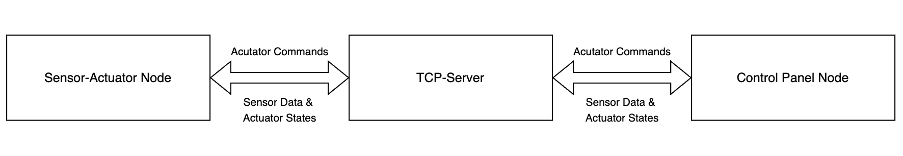

# Communication protocol

This document describes the protocol used for communication between the different nodes of the
distributed application.

## Terminology

- Sensor - a device which senses the environment and describes it with a value (an integer value in
  the context of this project). Examples: temperature sensor, humidity sensor.
- Actuator - a device which can influence the environment. Examples: a fan, a window opener/closer,
  door opener/closer, heater.
- Sensor and actuator node - a computer which has direct access to a set of sensors, a set of
  actuators and is connected to the Internet.
- Control-panel node - a device connected to the Internet which visualizes status of sensor and
  actuator nodes and sends control commands to them.
- Graphical User Interface (GUI) - A graphical interface where users of the system can interact with
  it.

## The underlying transport protocol

The transport-layer protocol we used in this project is TCP on port number 10025. We chose TCP because it provides reliable, error-checked delivery of data, which is essential for accurate sensor data sent between the server, sensor-actuator nodes and the control panel nodes. TCP ensure that the data is transmitted without loss.

The transport-layer protocol we used in this project is TCP on port number "". We chose this transport-layer protocol because it was the one we thought was best suited for this project.

## The architecture

The architecture of our network consists of:

* Server: Acts as a mediator between sensor-actuator nodes and control panel nodes. The greenhouse simulator is responsible for starting the TCP server. When the greenhouse simulator the server is started and listens on port 10025 for incomming TCP connections.

* Sensor-actuator nodes: Devices that simulate sensors (e.g. temperature, humidity) and actuators (e.g. fans, heaters). Each node is represented by the SensorActuatorNode class and connects to the server using the SensorActuatorTcpClient class.

* Control Panel Nodes: Applications with a graphical user interface (GUI) that display sensor data and allow users to control actuators. The control panel nodes are conneted to the server using the ControlPanelTcpClient class.

## The flow of information and events

### Sensor-Actuator Nodes

* Start-up: 
  * Each node connects to the server and sends a NODE_READY message containing its ID and actuator information.
* Sensor Data Transmission:
  * Nodes periodically send SENSOR_DATA messages to the server.
* Actuator commands:
  * Nodes receive ACTUATOR_COMMAD messages from the server and update atuators accordingly.

### Control Panel Nodes

* Start-up:
  * Control Panel nodes connect to the server and send a CONTROL_PANEL_CONNECT message.
* Receiving Data:
  * Receive NODE_READY, SENSOR_DATA, and ACTUATOR_STATE message from the server to display the information in the GUI.
* User Interaction:
  * Users can send acutator commands via the GUI.
  * ACTUATOR_COMMAND messages are sent to the server.

### Server

* Start-up:
  * The server starts listening for connections from Sensor-Actuator Nodes and Control Panel Nodes on port 10025.
* Message routing
  * The server forwards sensor data and actuator states to all connected control panels.
  * Routes actuator commands from control panels to the respective sensor-acutator nodes.

## Connection and state

Out communication is connection-oriented and stateful. Persistent TCP connections are established and maintained between:

* Sensor-Actuator Nodes and Server:
  * Nodes maintain a continous connection to send sensor data and receive actuator commands.
* Control Panel Nodes and Server:
  * Control panels maintain a connection to receive updates and send user commands.

The server keeps track of all connected nodes and control panels, maintaining their states and ensuring synchronized communication across the network.

## Message format

* Example messages:
  * SENSOR_DATA: Node 1 sent sensor data: temperature=27.74 °C,humidity=79.08 %
  * NODE_READY: NODE_READY;1;1_window, where the first number is the node number, and the second number is the actuator number, and the last word specifies the type of sensor.
  * ACTUATOR_COMMAND: ACTUATOR_COMMAND;1;2;true, where the first number is the the node number and the second number is the actuator number, true turns the actuator on, false off.
  * ACTUATOR_STATE: ACTUATOR_STATE;1;2;true, where the first number is the the node number and the second number is the actuator number, true means the actuator is on, false off.

### Error messages

* If a client receives a message from the server that it cannot parse or that is not in the protocol, it sends an error message back to the server:
  * ERROR;Invalid message format received from server
* If a client fails to process a command or action requested by the server, it notifies the server:
  * ERROR;Node 2 failed to execute actuator command
* When a client detects invalid data in messages, it reports the issue:
  * ERROR;Invalid sensor readings received

* When the server receives a message from a client that is not part of the protocol, it sends an error back to the client:
  * ERROR;Invalid message format
* If a client sends a message with a message type that the server doesn't recognize:
  * ERROR;Unknown message type: INVALID_TYPE
* When a control pane sends a command for a node ID that doesn't exist in the server's records:
  * ERROR;Node not found: 5
* If an actuator command references a non-existent actuator on the node:
  * ERROR;Invalid actuator ID: 999 on node 2
* For internal errors that occur wgile processing client requests:
  * ERROR;Server encountered an error processing your request

## An example scenario

1. A sensor node with ID=1 is started. It has a temperature sensor, two humidity sensors. It can
   also open a window.
2. A sensor node with ID=2 is started. It has a single temperature sensor and can control two fans
   and a heater.
3. A control panel node is started.
4. Another control panel node is started.
5. A sensor node with ID=3 is started. It has a two temperature sensors and no actuators.
6. After 5 seconds all three sensor/actuator nodes broadcast their sensor data.
7. The user of the first-control panel presses on the button "ON" for the first fan of
   sensor/actuator node with ID=2.
8. The user of the second control-panel node presses on the button "turn off all actuators".

1. Start up of simulator and server.
* The user starts the simulator which starts the server.
2. Startup of Sensor-Actuator Nodes
* The nodes starts and connect to the server
  * Sends NODE_READY message.
3. Startup of Control Panel Nodes (The user can start several control panels)
* Control Panel connects to the server
  * Sends a CONTROL_PANEL_CONNECT message: CONTROL_PANEL_CONNECT
4. Broadcast of Node information
* The server broadcasts the NODE_READY messages to all connected control panels.
* Control panels update their interfaces to display available nodes and actuators.
5. Every 5 seconds, each sensor-actuator node sends SENSOR_DATA message to the server:e.g.: SENSOR_DATA;1;temperature=27.74 °C,humidity=79.08 %
* The server forwards these messages to all control panels.
* Control panels displat the updated sensor readings.
6. User Interaction on Control Panel
* The user decides to turn ON the first fan on Node 2.
* Control panel sends an ACTUATOR_COMMAND message to the server: ACTUATOR_COMMAND;2;4;true
  * nodeId: 2
  * actuatorId: 4 (first fan on Node 2)
  * state: true (turn ON)
* The server forwards command to Node 2.
* Node 2 processes the command:
  * Turns on the fan with actuatorId 4.
  * Sends an ACTUATOR_STATE message to the server: ACTUATOR_STATE;2;4;true
* The server broadcasts the ACTUATOR_STATE message to all control panels.
* Control panels update the actuator status dispalt for Node 2.
7. Continuation of Sensor Data Transmission
* Sensor-actuator nodes continue sending SENSOR_DATA messages every 5 seconds.
* Control panels receive updated sensor readings and display them.

## Reliability and security

Our application implements several reliability and security mechanisms:

### Transport Layer Security
- Uses SSL encryption for all network communications via the [`SslConnection`](src/main/java/no/ntnu/ssl/SslConnection.java) class
- Requires keystore files and passwords for authentication

### Connection Reliability
- Uses TCP for reliable, ordered delivery of messages
- Runs on port 10025 with persistent connections
- Implements connection monitoring and cleanup:
  - Server detects disconnected clients
  - Clients detect server disconnection
  - Automatic resource cleanup on connection close

### Message Reliability  
- Protocol-defined message formats with validation
- Error handling for malformed messages

### Error Handling
- Error reporting
- Invalid message detection